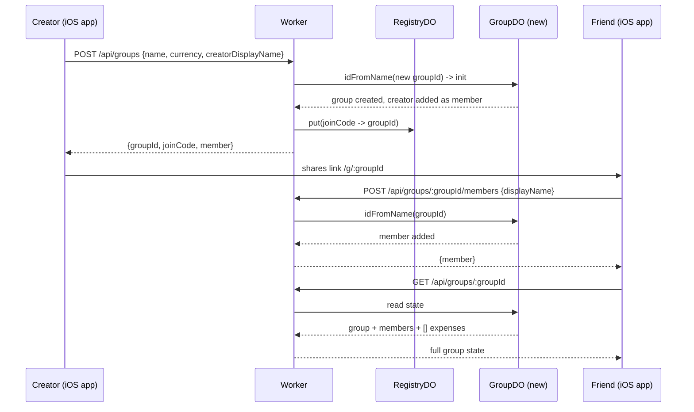
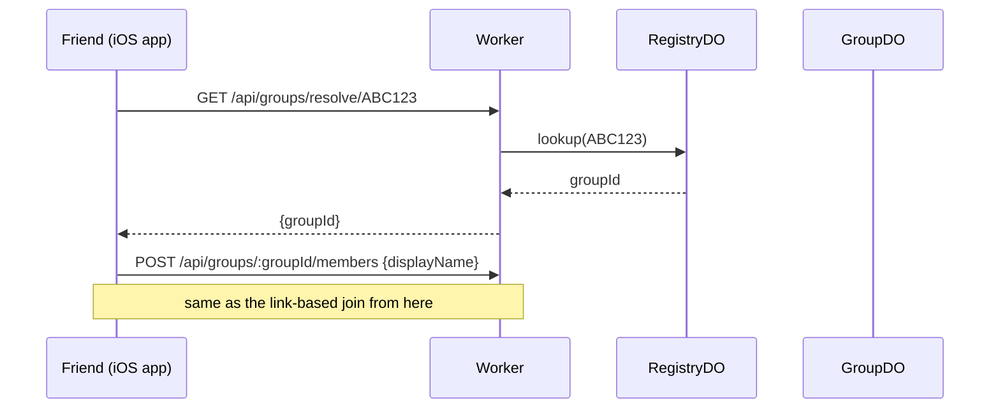
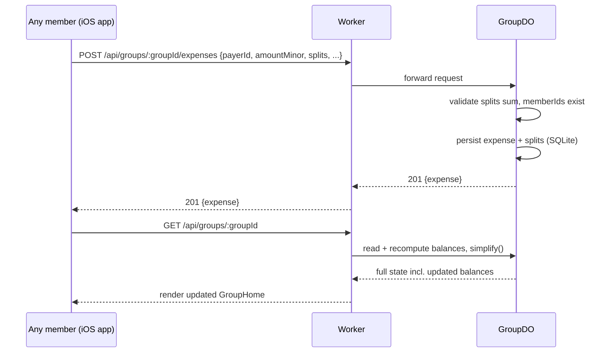

# Squarely — Technical Design Doc

This goes deeper than `PLAN.md` on the parts that need to be exact before Phase 2 gets built: the wire contract, the storage schema, the concurrency model, and the security model. `PLAN.md` remains the source of truth for product scope, the v1 feature list, and non-goals — nothing here overrides it. Read that first if you haven't.

---

## 1. Identifiers — two different IDs, doing two different jobs

This needs to be decided explicitly, because using one identifier for both jobs below would be a real security mistake.

- **`groupId`** — a long, high-entropy string (nanoid, 16 chars, ~95 bits of randomness). This is what's in the shareable link (`/g/:groupId`) and it is the literal name used to address the group's Durable Object (`env.GROUP_DO.idFromName(groupId)`). Security here is "capability URL" style, the same model Google Docs share links use: unguessable, not indexed, not enumerable. Nobody without the link can find a group.
- **`joinCode`** — a short, human-typeable code (6 chars, alphabet excluding visually ambiguous characters — no `0/O/1/I/l`), meant for reading aloud or typing on a phone keyboard. Low entropy by design (there are only ~2 billion possible codes at 6 chars from a 32-char alphabet) — **it must never be usable to derive or brute-force a `groupId`.**

Because of that entropy gap, `joinCode` cannot simply encode or hash to `groupId` — that would leak the high-entropy identifier through the low-entropy one. Instead:

### The Registry Durable Object
A single, well-known Durable Object instance (addressed by a fixed name, e.g. `idFromName("registry")`) holding a plain lookup table: `joinCode → groupId`. It is written to once, at group creation, and read from only when someone manually types a code instead of clicking a link. It never touches expense/balance data — it's a thin, low-traffic index, not a second source of truth. Rate-limit lookups against it specifically (see §8) since it's the one shared point of contact across every group.

**Collision handling:** on group creation, generate a `joinCode`, check the Registry for an existing entry, regenerate on collision (expected to be rare at this keyspace, but must be handled, not assumed away).

---

## 2. API contract

All routes are served by the single Worker (`src/worker/index.ts`), which does nothing but route to the right Durable Object and pass the response through. Base path: `/api`.

**Error envelope (all error responses):**
```json
{ "error": { "code": "SPLIT_MISMATCH", "message": "Splits must sum to the expense amount." } }
```

### `POST /api/groups`
Create a group and its first member in one call.
```
Request:  { name: string, currency: string, creatorDisplayName: string }
Response: 201 { groupId, joinCode, member: { id, displayName }, group: { name, currency, createdAt } }
```
Side effect: writes `{ joinCode → groupId }` to the Registry DO.

### `GET /api/groups/resolve/:joinCode`
The only Registry-backed route. Used only by the "I was told a code, not a link" entry path.
```
Response: 200 { groupId }  |  404 if unknown
```

### `POST /api/groups/:groupId/members`
Join an existing group.
```
Request:  { displayName: string }
Response: 201 { member: { id, displayName } }
Errors:   404 GROUP_NOT_FOUND
```

### `GET /api/groups/:groupId`
The single "give me everything" endpoint. Called on load and after every mutation — this is the entire sync model (§ per `PLAN.md` §0: fetch-on-load/refetch, no WebSocket in v1). Balances and the simplified settle-up list are computed **server-side**, inside the DO, so that logic exists in exactly one place (`worker/lib/balances.ts` and `simplify.ts`) and the client never reimplements it.
```
Response: 200 {
  group: { name, currency, createdAt, joinCode },
  members: [{ id, displayName }],
  expenses: [{ id, payerId, amountMinor, description, date, splitType, splits: [...] }],
  settlements: [{ id, fromId, toId, amountMinor, date }],
  balances: [{ memberId, netMinor }],
  simplifiedSettlements: [{ fromId, toId, amountMinor }]
}
```

### `POST /api/groups/:groupId/expenses`
```
Request:  { id?: string, payerId, amountMinor, description, date, splitType: "equal"|"exact",
            splits: [{ memberId, amountMinor }] }
Response: 201 { expense: {...} }
Errors:   400 SPLIT_MISMATCH   — splits don't sum to amountMinor
          400 UNKNOWN_MEMBER   — payerId or a split memberId isn't in this group
          400 INVALID_AMOUNT   — amountMinor <= 0, or not an integer
```
`id` is optional and client-generated (UUID). If provided and it already exists, the DO treats this as a no-op replay (idempotent retry-safe) rather than a duplicate — covers the case where a client times out and retries a POST that actually succeeded.

### `POST /api/groups/:groupId/settlements`
```
Request:  { id?: string, fromId, toId, amountMinor }
Response: 201 { settlement: {...} }
Errors:   400 UNKNOWN_MEMBER, 400 INVALID_AMOUNT
```
Same idempotency treatment via optional client-generated `id`.

---

## 3. Storage schema (SQLite, inside each Durable Object)

### `GroupDO`
```sql
CREATE TABLE group_meta (
  key   TEXT PRIMARY KEY,
  value TEXT NOT NULL
);  -- rows: name, currency, join_code, schema_version, created_at

CREATE TABLE members (
  id           TEXT PRIMARY KEY,
  display_name TEXT NOT NULL,
  created_at   INTEGER NOT NULL
);

CREATE TABLE expenses (
  id           TEXT PRIMARY KEY,
  payer_id     TEXT NOT NULL REFERENCES members(id),
  amount_minor INTEGER NOT NULL,
  description  TEXT NOT NULL,
  expense_date TEXT NOT NULL,
  split_type   TEXT NOT NULL CHECK (split_type IN ('equal','exact')),
  created_at   INTEGER NOT NULL
);

CREATE TABLE expense_splits (
  expense_id   TEXT NOT NULL REFERENCES expenses(id),
  member_id    TEXT NOT NULL REFERENCES members(id),
  amount_minor INTEGER NOT NULL,
  PRIMARY KEY (expense_id, member_id)
);

CREATE TABLE settlements (
  id           TEXT PRIMARY KEY,
  from_id      TEXT NOT NULL REFERENCES members(id),
  to_id        TEXT NOT NULL REFERENCES members(id),
  amount_minor INTEGER NOT NULL,
  settled_at   INTEGER NOT NULL
);
```
All money as `INTEGER` minor units (paise/cents) — never `REAL`. This is the same rule as `AGENTS.md`, just enforced at the schema level too.

### `RegistryDO` (the one singleton instance)
```sql
CREATE TABLE join_codes (
  code       TEXT PRIMARY KEY,
  group_id   TEXT NOT NULL,
  created_at INTEGER NOT NULL
);
```

---

## 4. Concurrency & consistency model

This is the load-bearing assumption behind "correctness for free" in `PLAN.md` §0, so it's worth stating explicitly rather than leaving implicit: **Cloudflare guarantees a single Durable Object instance processes one request to completion before starting the next** (its input/output gate serializes access). Two members submitting expenses to the same group at the "same" wall-clock moment are still handled strictly one-after-another inside that group's DO — there is no read-modify-write race on balances, because nothing runs concurrently against the same instance in the first place.

What this does **not** give you, and what v1 doesn't need: cross-group transactions (each group is a fully independent DO, there's never a reason for two groups to coordinate), or protection against a client showing stale data between its last fetch and its next one (that's just the fetch-on-load/refetch model working as designed — see `PLAN.md` §0).

---

## 5. Key flows

### Create a group, then someone joins via the link


### Someone joins by typed code instead of a link


### Add an expense


---

## 6. Validation rules (enforced in the DO, not just the UI)

The UI should prevent invalid input, but the DO validates independently — never trust the client, even though there's no auth to abuse here beyond "someone submits garbage."

- Every `splits[].amountMinor` sums to exactly `amountMinor`. No tolerance — if `equal` split doesn't divide evenly, the remainder is assigned to one deterministic member (the payer) client-side before the request is even sent, so the server-side check is always an exact match.
- Every `memberId` referenced (payer, splits, settlement from/to) must exist in this group.
- All amounts are positive integers.
- `splitType` is exactly `"equal"` or `"exact"`.
- Reject unknown fields rather than silently ignoring them (fail loud during development).

---

## 7. Client-side state management

*(This section originally sketched a hypothetical web client; the client actually built in this repo is the native iOS app in `App/`, described below — no web client exists here.)*

`SquareKit.SquarelyClient` is a plain async/await HTTP client — **no third-party networking library**, consistent with the zero-third-party-dependency rule in `AGENTS.md`. The app's `GroupViewModel` (`App/Squarely/ViewModels/GroupViewModel.swift`) wraps it and exposes `{ state, isLoading, errorMessage }` plus `load()`/`refetch()`. Every mutation (`addExpense`, `addSettlement`, `joinGroup`) is a plain async call that POSTs, then the caller invokes `refetch()` on success — no optimistic UI in v1 (optimistic updates add real complexity for a low-frequency app where a half-second round trip is a non-issue). `SquareKit.UserDefaultsIdentityStore` reads/writes `UserDefaults` under the key `"squarely:" + groupId` to remember `{ memberId, displayName }` per device per group — the iOS equivalent of a web client's `localStorage`-backed `identity.ts`.

---

## 8. Security considerations

- **No accounts means the link is the only credential.** Anyone with the `groupId` (via link or resolved code) can read and write that group's data. This is a documented trust model (§ `PLAN.md` §6 risks), not an oversight — same as Spliit, same as sharing a Splitwise group invite.
- **Never let a group page get indexed.** Serve `X-Robots-Tag: noindex` on all `/api/groups/*` responses and `<meta name="robots" content="noindex">` on the group HTML page. A capability URL that ends up in a search index defeats its own security model.
- **Rate-limit the Registry DO's lookup route specifically** — it's the one shared surface across every group, so it's the one place someone could attempt to enumerate join codes. A simple per-IP counter (e.g. 20 lookups/minute) inside `RegistryDO` is enough; the keyspace (32^6) already makes brute-forcing impractical, this is defense in depth, not the primary control.
- **CORS:** the Worker serves both the frontend and the API from the same origin, so CORS can stay locked to same-origin — no need to open it up.
- **No PII beyond a display name the user chose themselves.** No emails, no phone numbers, no payment details ever collected — consistent with `PLAN.md`'s non-goals.

---

## 9. Non-functional notes

**Cold starts:** a Durable Object that hasn't been hit recently has a small cold-start cost on its next request (well under a second in practice, but not zero). This app already involves a network round trip on every screen (unlike the rest of the portfolio, which is instant/local) — design loading states as a normal part of the experience rather than something to hide.

**Free-tier headroom, worked out concretely:** at 5–10 people per group, low frequency — say each person opens the app a couple of times a week, mostly a single `GET` per visit plus occasional `POST`s — that's roughly 50–100 requests/week per group, well under 15/day. The Workers free plan allows 100,000 requests/day. Even fifty separate groups running simultaneously (i.e. this genuinely catching on beyond your own friend group) would sit at well under 1% of the daily free quota. This is not a real constraint at any scale this project is likely to reach.

---

## 10. Schema evolution

`group_meta` includes a `schema_version` row from day one, even though v1 only ever writes version `1`. If a later change needs a different shape (e.g. adding multi-currency support to `expenses`), the DO's init/upgrade path reads this value and can migrate in place — decide the migration approach *when* that happens, not now, but the version field has to exist from the start or there's nothing to branch on later.

---

## 11. Testing strategy

- **Unit (Vitest, no Cloudflare involved):** `balances.ts`, `simplify.ts` — the tests already specified in `PLAN.md` §2. These are the tests that matter most; they're pure functions and should be exhaustively covered.
- **Integration (`wrangler dev` / Miniflare):** exercise the actual HTTP routes against a real (local) Durable Object — covers request parsing, validation, persistence, and the Registry lookup flow end-to-end.
- **What can't be meaningfully tested locally:** the single-writer serialization guarantee in §4 is a property of Cloudflare's production runtime, not something Miniflare can prove under real concurrent load. Trust the platform guarantee rather than trying to simulate a race condition locally — if this ever needs verifying, it'd be a small production load test, not a unit test.

---

## 12. Deliberately deferred (not forgotten)

- ~~**`GET /api/groups/:groupId` doesn't return `joinCode`**~~ — **decided
  (2026-08-28): it now does.** §2's `group` object is
  `{ name, currency, createdAt, joinCode }`. Originally the code was only
  shown once, right after creation (the iOS app surfaced it in a post-creation
  confirmation step); anyone joining later or reopening the app couldn't look
  it up. The code is already low-entropy and Registry-resolvable, so returning
  it from the state endpoint adds no new exposure and lets Group Home re-share
  it. The Worker was built with this from the start; the iOS `GroupSummary`
  carries the field.
- WebSocket live updates (upgrade path exists — same DO, add a WebSocket handler alongside the HTTP one — but not built until Phase 6+ per `PLAN.md`, and only if usage shows people actually have the app open simultaneously)
- Optimistic UI updates on mutation
- Multi-currency, recurring expenses, percentage/shares splitting, receipt OCR — all explicitly out of scope per `PLAN.md` §1, listed here again only so nobody mistakes their absence in this doc for an oversight
- A "merge my old entries" flow for someone who loses local storage and rejoins as a new member
