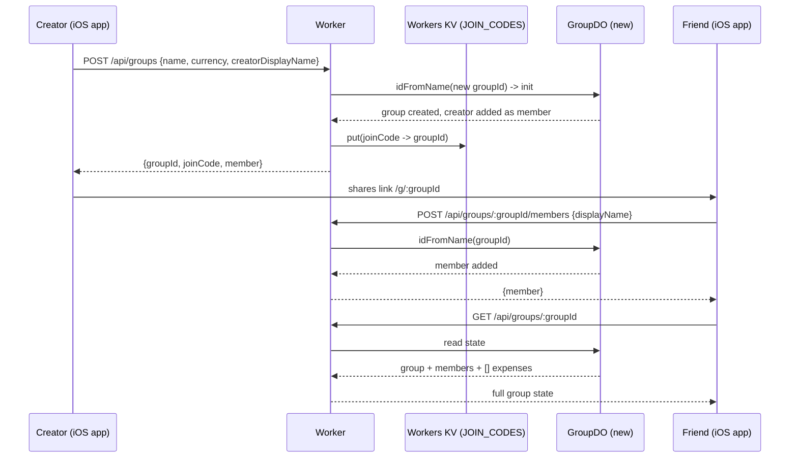
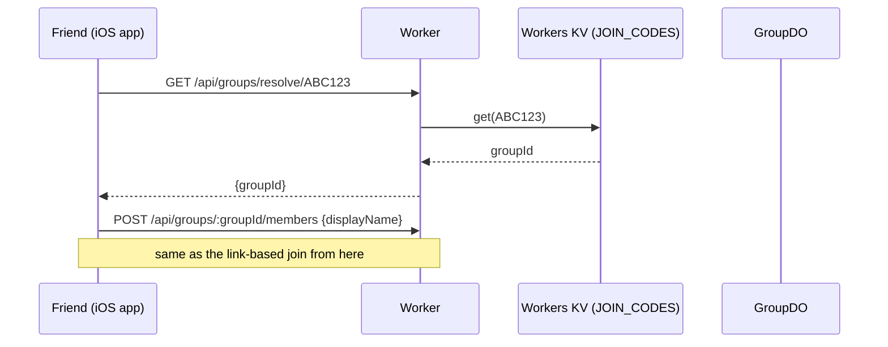
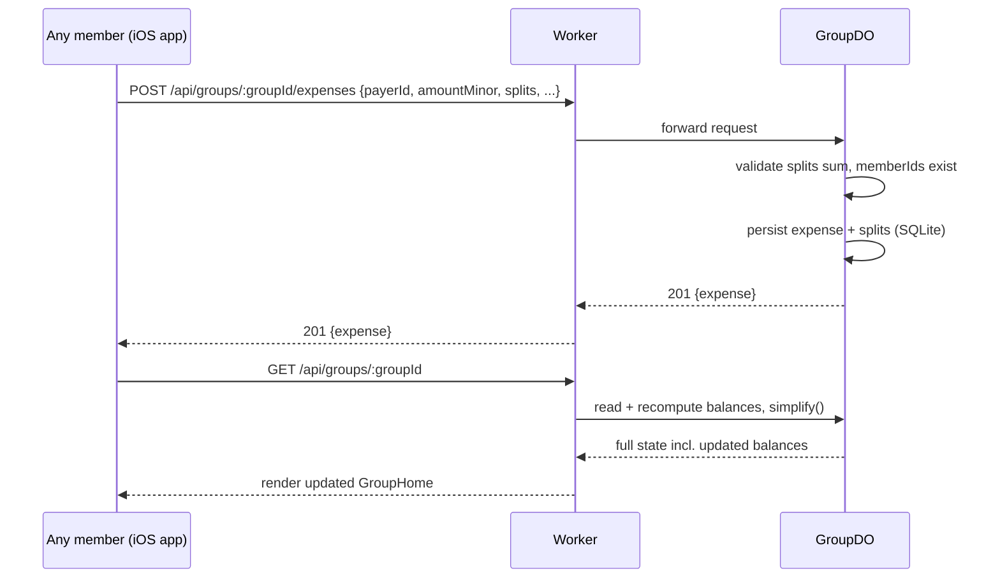

# ClanTab — Technical Design Doc

The technical contract for ClanTab's backend: the wire contract, the storage schema, the concurrency model, and the security model. This is the living source of truth for how the system actually works — when the code and this doc disagree, fix whichever one is wrong, don't assume either is right by default.

**Non-goals (still true, kept here so nobody mistakes an absence for an oversight):** no payment processing (settling is a manual "I paid outside the app" click); no FX conversion (a group can hold multiple currencies, never converted or blended); no recurring *expenses* (recurring local reminders to add one manually are in scope — the expense itself is never auto-posted); no paid cloud AI / receipt OCR; no passwords — identity is Apple or Google sign-in only, requesting no scopes (no name, no email, no profile).

---

## 1. Identifiers — two different IDs, doing two different jobs

This needs to be decided explicitly, because using one identifier for both jobs below would be a real security mistake.

- **`groupId`** — a long, high-entropy string (nanoid, 16 chars, ~95 bits of randomness). This is what's in the shareable link (`/g/:groupId`) and it is the literal name used to address the group's Durable Object (`env.GROUP_DO.idFromName(groupId)`). Security here is "capability URL" style, the same model Google Docs share links use: unguessable, not indexed, not enumerable. Nobody without the link can find a group.

  **The shared link is a Universal Link** (2026-09-09, `CHECKLIST.md` "Custom domain + Universal Links"): `https://clantab.nakka.dev/g/:groupId?token=…` (host = `AppConfig.shareLinkBaseURL`, deliberately *not* `apiBaseURL` — the API stays on `workers.dev`, only the human-shared link is branded). The `apple-app-site-association` is served from the `nakka-labs/clantab-website` Pages repo at `/.well-known/apple-app-site-association` (`application/json`, no redirect), scoped `applinks: /g/*` so only invite links open the app and the marketing pages stay web; app ID `UK652GNPP7.com.clantab.app`. A Cloudflare Worker Route `clantab.nakka.dev/g/*` → the `clantab` Worker serves the noindex "Open in ClanTab" fallback page (`handleCapabilityPage`) for a recipient without the app; the `clantab://g/:groupId` custom scheme is the fallback path and the only form testable in the Simulator. iOS entry: a real `UISceneDelegate` (`App/ClanTab/SceneDelegate.swift`) funnels every URL — cold launch and warm, both link types — through `IncomingURL` to `RootView.handleDeepLink`, because providing a custom scene delegate suppresses SwiftUI's `.onOpenURL`.
- **`joinCode`** — a short, human-typeable code (6 chars, alphabet excluding visually ambiguous characters — no `0/O/1/I/l`), meant for reading aloud or typing on a phone keyboard. Low entropy by design (there are only ~2 billion possible codes at 6 chars from a 32-char alphabet) — **it must never be usable to derive or brute-force a `groupId`.**
- **`access_token`** — an optional, rotatable secret (22 chars, ~132 bits) stored in `group_meta` alongside the group, added 2026-09-05 so a leaked or shared link can be revoked without losing the group's permanent `groupId` identity. Carried as a `?token=` query param on every group-data route (§2, §8); "Regenerate Link" mints a new one and immediately invalidates the old. A group created before this existed has none and stays open until it first regenerates.

Because of that entropy gap, `joinCode` cannot simply encode or hash to `groupId` — that would leak the high-entropy identifier through the low-entropy one. Instead:

### The Registry Durable Object
A single, well-known Durable Object instance (addressed by a fixed name, e.g. `idFromName("registry")`) holding a plain lookup table: `joinCode → groupId`. It is written to once, at group creation, and read from only when someone manually types a code instead of clicking a link. It never touches expense/balance data — it's a thin, low-traffic index, not a second source of truth. Rate-limit lookups against it specifically (see §8) since it's the one shared point of contact across every group.

**Collision handling:** on group creation, generate a `joinCode`, check the Registry for an existing entry, regenerate on collision (expected to be rare at this keyspace, but must be handled, not assumed away).

---

## 2. API contract

All routes are served by the single Worker (`src/worker/index.ts`), which does nothing but route to the right Durable Object and pass the response through. Base path: `/api`.

**Error envelope (all error responses):**
```json
{ "error": { "code": "SPLIT_MISMATCH", "message": "Splits must sum to the expense amount." } }
```

### `POST /api/groups`
Create a group and its first member in one call.
```
Request:  { name: string, currency: string, creatorDisplayName: string }
Response: 201 { groupId, joinCode, member: { id, displayName }, group: { name, currency, createdAt } }
```
Side effect: writes `{ joinCode → groupId }` to the Registry DO.

### `GET /api/groups/resolve/:joinCode`
The only Registry-backed route. Used only by the "I was told a code, not a link" entry path.
```
Response: 200 { groupId }  |  404 if unknown
```

### `PATCH /api/groups/:groupId`
```
Request:  { name?: string, currency?, emoji?: string | null }
          (at least one; unknown keys rejected)
Response: 200 { group: {...} }            the updated GroupSummary
```
Renames the group and/or changes its **default** currency for new expenses.
Existing expenses/settlements keep their own currency (§ multi-currency — the
group currency is only a default). `emoji` is the group's visual-identity
emoji (shown in the groups list and the Group Home header): a string sets it,
an explicit `null` clears it, omitting the key leaves it alone (same
tri-state as a member's `upiVpa`, §2). Stored as a `group_meta` key —
nullable, a new key not a schema-version bump, same as `access_token`.

### `POST /api/groups/:groupId/members`
Join an existing group (also how the app adds a placeholder member).
```
Request:  { displayName: string }
Response: 201 { member: { id, displayName } }
Errors:   404 GROUP_NOT_FOUND
```

### `PATCH /api/groups/:groupId/members/:memberId` · `DELETE .../members/:memberId`
```
PATCH   { displayName }  → 200 { member }
DELETE                   → 204
Errors: 404 NOT_FOUND        — no such member in this group
        409 MEMBER_IN_USE    — (DELETE only) the member is on an expense/split/
                               settlement, is linked to an account, or is the
                               group's last member
```
Renaming is cosmetic — every record keys off `memberId`. A member can only be
removed once they have zero activity.

### `GET /api/groups/:groupId`
The single "give me everything" endpoint. Called on load and after every mutation — this is the entire sync model (fetch-on-load/refetch, no WebSocket in v1). Balances and the simplified settle-up list are computed **server-side**, inside the DO, so that logic exists in exactly one place (`worker/lib/balances.ts` and `simplify.ts`) and the client never reimplements it.
```
Response: 200 {
  group: { name, currency, createdAt, joinCode },
  members: [{ id, displayName }],
  expenses: [{ id, payerId, amountMinor, currency, description, date, splitType,
               splits: [...], category?, categoryIcon? }],
  settlements: [{ id, fromId, toId, amountMinor, currency, date }],
  balances: [{ memberId, currency, netMinor }],           // per-currency, nonzero only
  simplifiedSettlements: [{ fromId, toId, amountMinor, currency }]
}
```

`balances` and `simplifiedSettlements` are **partitioned by currency** — a group is not restricted to one currency and the ledgers are never blended (no FX). A member owed in one currency and owing in another has one `balances` entry per currency; `simplifiedSettlements` runs the greedy plan once per currency. Both are ordered by currency in first-appearance order across the combined expense-then-settlement stream. `balances` omits (member, currency) pairs that net to zero.

### `POST /api/groups/:groupId/expenses`
```
Request:  { id?: string, payerId, amountMinor, currency?, description, date,
            splitType: "equal"|"exact"|"percentage",
            splits: [{ memberId, amountMinor }],
            category?: string, categoryIcon?: string }
Response: 201 { expense: {...} }
Errors:   400 SPLIT_MISMATCH   — splits don't sum to amountMinor
          400 UNKNOWN_MEMBER   — payerId or a split memberId isn't in this group
          400 INVALID_AMOUNT   — amountMinor <= 0, or not an integer
```
`id` is optional and client-generated (UUID). If provided and it already exists, the DO treats this as a no-op replay (idempotent retry-safe) rather than a duplicate — covers the case where a client times out and retries a POST that actually succeeded.

`splitType` is a label describing how the client divided the amount; `percentage` reaches the server already resolved to exact minor-unit `splits` (the client does the division, exactly as `equal` resolves its own remainder — see §6). The server validates `splits` sum to `amountMinor` regardless of `splitType`.

`category` is a free-form label and `categoryIcon` its SF Symbol name (`ClanTabKit.ExpenseCategory`). Both optional — omitted entirely when unset. Stored verbatim, not validated against a list; the icon is stored per expense so any client renders it without a shared name→icon table.

`currency` (ISO 4217, both endpoints) is optional and defaults server-side to the group's currency — the iOS client always sends it explicitly (its last-used currency for the group). `amountMinor` and every split are in this currency. It is stored verbatim, not validated against a list.

### `POST /api/groups/:groupId/settlements`
```
Request:  { id?: string, fromId, toId, amountMinor, currency? }
Response: 201 { settlement: {...} }
Errors:   400 UNKNOWN_MEMBER, 400 INVALID_AMOUNT
```
Same idempotency treatment via optional client-generated `id`.

### `PUT /api/groups/:groupId/expenses/:expenseId` · `PUT .../settlements/:settlementId`
```
Request:  same body as the matching POST, minus `id` (the path carries it —
          a body `id` is rejected)
Response: 200 { expense: {...} } / 200 { settlement: {...} }
Errors:   404 NOT_FOUND        — no such expense/settlement in this group
          400 SPLIT_MISMATCH / UNKNOWN_MEMBER / INVALID_AMOUNT (re-validated)
```
A full replacement, not a patch — send the whole record. `created_at` /
`settled_at` is preserved so an edit doesn't reorder the activity feed. Balances
are derived on read, so nothing else needs adjusting.

### `DELETE /api/groups/:groupId/expenses/:expenseId` · `DELETE .../settlements/:settlementId`
```
Response: 204  (idempotent — deleting an id that's already gone still 204s)
```
Removes the row (and an expense's splits). Same trust model as every other §2
route: possession of the `groupId` is the only credential.

### `POST /api/groups/:groupId/regenerate-link`
```
Response: 200 { accessToken: string }
```
Rotates the group's `access_token` (§1, §8) — every previously shared
link/code stops working immediately for anyone relying on the old token; a
claimed member's Bearer session is unaffected. Same flat trust model as
every other route here — no special "owner" tier, anyone who can currently
reach the group can regenerate its link.

**Every route above also accepts `?token=<access_token>`** once a group has
one (§1) — omitted or wrong when a token exists → 403 `FORBIDDEN`, except
for a request authenticated instead by a claimed member's Bearer session
(§13), which is always a valid alternate path.

---

## 3. Storage schema (SQLite, inside each Durable Object)

### `GroupDO`
```sql
CREATE TABLE group_meta (
  key   TEXT PRIMARY KEY,
  value TEXT NOT NULL
);  -- rows: name, currency, join_code, schema_version, created_at,
    -- access_token (nullable, added 2026-09-05 — a new key, not a
    -- schema-version bump; see §1/§2/§8),
    -- emoji (nullable, added 2026-09-07 — likewise a new key; the group's
    -- visual-identity emoji, set via PATCH, §2)

CREATE TABLE members (
  id           TEXT PRIMARY KEY,
  display_name TEXT NOT NULL,
  created_at   INTEGER NOT NULL,
  identity_sub TEXT,          -- nullable; the "provider:sub" this member is claimed by (§13), added in v5. NULL = placeholder
  upi_vpa      TEXT           -- nullable; user-supplied UPI ID, added in v7 — never verified or processed by ClanTab
);

CREATE TABLE expenses (
  id            TEXT PRIMARY KEY,
  payer_id      TEXT NOT NULL REFERENCES members(id),
  amount_minor  INTEGER NOT NULL,
  description   TEXT NOT NULL,
  expense_date  TEXT NOT NULL,
  split_type    TEXT NOT NULL CHECK (split_type IN ('equal','exact','percentage')),
  created_at    INTEGER NOT NULL,
  category      TEXT,          -- nullable; added in schema v3
  category_icon TEXT,          -- nullable; SF Symbol name
  currency      TEXT,          -- nullable in DDL; added + backfilled in v4, always written since
  deleted_at    INTEGER,       -- nullable; soft-delete timestamp, added in v6
  deleted_by    TEXT           -- nullable; memberId that deleted it, added in v6 — client-supplied, trusted like every other id here
);

CREATE TABLE expense_splits (
  expense_id   TEXT NOT NULL REFERENCES expenses(id),
  member_id    TEXT NOT NULL REFERENCES members(id),
  amount_minor INTEGER NOT NULL,
  PRIMARY KEY (expense_id, member_id)
);

CREATE TABLE settlements (
  id           TEXT PRIMARY KEY,
  from_id      TEXT NOT NULL REFERENCES members(id),
  to_id        TEXT NOT NULL REFERENCES members(id),
  amount_minor INTEGER NOT NULL,
  settled_at   INTEGER NOT NULL,
  currency     TEXT,          -- nullable in DDL; added + backfilled in v4
  deleted_at   INTEGER,       -- nullable; soft-delete timestamp, added in v6
  deleted_by   TEXT           -- nullable; memberId that deleted it, added in v6
);
```
All money as `INTEGER` minor units (paise/cents) — never `REAL`. This is the same rule as `AGENTS.md`, just enforced at the schema level too.

### `joinCode → groupId` index — Workers KV, not a Durable Object

Originally a singleton `RegistryDO` with this SQLite table:
```sql
CREATE TABLE join_codes (
  code       TEXT PRIMARY KEY,
  group_id   TEXT NOT NULL,
  created_at INTEGER NOT NULL
);
```
Retired (2026-09-05): every group creation and every join-code
lookup for the entire app serialized through that one Durable Object instance
— the one real architectural scaling ceiling. Replaced with a plain
`JOIN_CODES` Workers KV namespace (`worker/src/lib/join-codes.ts`): `code →
groupId`, written once at group creation, read on lookup, no shared instance
to serialize through. KV's eventual consistency (propagation up to ~60s) is a
non-issue — a code is always looked up well after the creator shares it, never
in the same request that minted it.

---

## 4. Concurrency & consistency model

This is the load-bearing assumption behind "correctness for free," so it's worth stating explicitly rather than leaving implicit: **Cloudflare guarantees a single Durable Object instance processes one request to completion before starting the next** (its input/output gate serializes access). Two members submitting expenses to the same group at the "same" wall-clock moment are still handled strictly one-after-another inside that group's DO — there is no read-modify-write race on balances, because nothing runs concurrently against the same instance in the first place.

What this does **not** give you, and what v1 doesn't need: cross-group transactions (each group is a fully independent DO, there's never a reason for two groups to coordinate), or protection against a client showing stale data between its last fetch and its next one (that's just the fetch-on-load/refetch model working as designed).

---

## 5. Key flows

### Create a group, then someone joins via the link


### Someone joins by typed code instead of a link


### Add an expense


---

## 6. Validation rules (enforced in the DO, not just the UI)

The UI should prevent invalid input, but the DO validates independently — never trust the client, even though there's no auth to abuse here beyond "someone submits garbage."

- Every `splits[].amountMinor` sums to exactly `amountMinor`. No tolerance — if an `equal` or `percentage` split doesn't divide evenly, the remainder is assigned to one deterministic member (the payer) client-side before the request is even sent, so the server-side check is always an exact match.
- Every `memberId` referenced (payer, splits, settlement from/to) must exist in this group.
- All amounts are positive integers.
- `splitType` is exactly `"equal"`, `"exact"`, or `"percentage"`. It is descriptive only — the server never re-derives shares from it; `percentage` splits arrive pre-resolved to minor units (`ClanTabKit.Validation.percentageSplit`), so the balance math is identical for all three.
- Reject unknown fields rather than silently ignoring them (fail loud during development).

---

## 7. Client-side state management

*(This section originally sketched a hypothetical web client; the client actually built in this repo is the native iOS app in `App/`, described below — no web client exists here.)*

`ClanTabKit.ClanTabClient` is a plain async/await HTTP client — **no third-party networking library**, consistent with the zero-third-party-dependency rule in `AGENTS.md`. The app's `GroupViewModel` (`App/ClanTab/ViewModels/GroupViewModel.swift`) wraps it and exposes `{ state, isLoading, errorMessage }` plus `load()`/`refetch()`/`autoRefetch()`. Every mutation (`addExpense`, `addSettlement`, `joinGroup`) is a plain async call that POSTs, then the caller invokes `refetch()` on success — no optimistic UI in v1 (optimistic updates add real complexity for a low-frequency app where a half-second round trip is a non-issue). Group Home also runs a lightweight foreground poll — `autoRefetch()` every `GroupViewModel.pollInterval` while the view is on screen, plus an immediate refresh when the app returns to the foreground — so another device's expenses and settlements appear without a manual pull-to-refresh. It's a silent GET that keeps the last good `state` on a transient failure; full WebSocket push is still the eventual, not-yet-built upgrade. `ClanTabKit.UserDefaultsIdentityStore` reads/writes `UserDefaults` under the key `"clantab:" + groupId` to remember `{ memberId, displayName }` per device per group — the iOS equivalent of a web client's `localStorage`-backed `identity.ts`.

**Identity layer (accounts, §13).** Sign in with Apple or Google is mandatory as of 2026-09-05 — there's no guest mode to drop to. `ClanTabClient` calls `/api/auth/*` (§13) and carries `Authorization: Bearer <session token>` on those calls only — never on the group routes, which stay `groupId` (+ optional access-token) possession, per §8. The app's `AuthViewModel` owns the session (`KeychainSessionStore`, `kSecAttrAccessibleAfterFirstUnlock`), a launch-time `getCredentialState` check, and a near-expiry token refresh. `KnownGroupsStore` holds the signed-in user's groups, fanned out from the authoritative `GET /api/auth/groups` list (also seeding `IdentityStore` so a claimed member is greeted on a fresh device).

**Off-device backup (two tiers).** Tier 1 is a recurring Group Home card (`BackupNudge`, every 30 days) nudging the user to run the existing CSV/JSON export's share sheet — "Save to Files" already reaches iCloud Drive and Google Drive, zero new export code. Tier 2 (2026-09-08) is automatic: on every successful group-state fetch of a *claimed* group, `GroupViewModel` fires a fire-and-forget `CloudKitGroupBackup` write of a lossless ledger snapshot (`ClanTabKit.CloudBackup` — the `Export.json` shape plus `groupId`/`capturedAt`/`schemaVersion`) to the user's **private** CloudKit database, one `GroupBackup` record per group (keyed by `CloudBackup.recordName`, so a re-backup overwrites in place). Self-throttling: `CloudBackupSchedule` skips the write unless the payload checksum changed (≥ 10 min since the last) or a day has passed. It is a **backup destination only** — nothing reads a `CKRecord` back into live `state`; `GroupDO` stays the single source of truth (§4, `AGENTS.md`). Every failure path (no iCloud account, container not provisioned yet, offline, any `CKError`) is swallowed — a backup that doesn't happen is never user-facing.

**Local device cache — what persists, what doesn't, and why (2026-09-09).** `KnownGroupsStore` (`UserDefaults`) is the only *cross-launch* local cache: per known group it holds `{ name, emoji, myBalances, accessToken, lastOpenedAt }` — never the expense/settlement line items themselves. `GroupViewModel.state` (the full ledger for whichever group is on screen) lives only in that view's in-memory `@Observable` state — gone the moment the app terminates, refetched fresh on the next launch. Deliberate, not an oversight: it keeps plaintext ledger detail off disk except in the two intentional off-device copies already covered above (the CSV/JSON export share sheet, and the tier-2 CloudKit backup — both user-initiated or opt-out-able). `myBalances` is a display cache exactly like the widget snapshot (`WidgetSnapshotStore`'s own doc comment) — never a second source of truth, always replaced wholesale by the same `Balances.compute` output every other view uses. See §8 for a gap found in this same review: `accessToken` in that same `UserDefaults` blob doesn't get the Keychain protection the session token gets.

**Group dashboard (2026-09-09 brainstorm; build tracked in `CHECKLIST.md`, not started).** The launch screen becomes a cross-group dashboard (every known group + a currency-bucketed net-balance summary) instead of auto-opening the device's one group. Naively refreshing every known group's balance on every cold launch would fan one `GroupDO` read out per group on the single highest-frequency event in the app — considered and rejected, §12. The chosen design treats **writes as the trigger, not launches**: `notifyGroup`'s existing per-recipient push loop (`worker/src/lib/notify.ts`) already has that recipient's freshly-mutated balance in hand from the write it's notifying about, so attaching `{groupId, currency, netMinor}` to the push payload's `data` field costs nothing new — the iOS push handler writes it straight into `KnownGroupsStore.updateBalances()` on receipt (foreground or background), and the dashboard reads only that local cache, zero network calls on open. Push delivery isn't guaranteed (iOS throttles/drops silently; some users deny notification permission outright), so this needs a bounded fallback, not blind trust: pull-to-refresh, plus a time-boxed periodic reconcile (once a day, or once per cold-start-after-N-hours — never every launch) that does the rare N+1 catch-up fan-out, the same shape `GET /api/auth/people` (§13) already uses for cross-group settling — probably its own sibling worker endpoint rather than N client round-trips. **Update this note** the moment any piece of it ships or the design changes, the same way every other dated note in this doc gets kept honest — an unmaintained design note is worse than no note.


---

## 8. Security considerations

- **`groupId` (+ an optional access token) is the credential, not an account.** Anyone holding the `groupId` (via link or resolved code) — and the group's current `access_token`, once one exists — can read and write that group's data. This is a documented trust model, not an oversight — same as Spliit, same as sharing a Splitwise group invite. A leaked or shared link can be revoked without losing the group's data identity: "Regenerate Link" (`POST .../regenerate-link`, §2) rotates the `access_token` in `group_meta`, and every previously shared link/code stops working immediately — a claimed member's Bearer session is unaffected (dual-auth, not a replacement). A group created before 2026-09-05 has no token yet and stays open until it first regenerates, which lazily mints one — no deploy-time backfill.
- **Never let a group page get indexed.** Serve `X-Robots-Tag: noindex` on all `/api/groups/*` responses and `<meta name="robots" content="noindex">` on the group HTML page. A capability URL that ends up in a search index defeats its own security model.
- **Rate-limit the join-code lookup route specifically** — it's the one shared surface across every group, so it's the one place someone could attempt to enumerate join codes. A per-IP cap (20 lookups/minute, a Cloudflare Rate Limiting binding — `RESOLVE_RATE_LIMITER` in `wrangler.jsonc`) is enough; the keyspace (32^6) already makes brute-forcing impractical, this is defense in depth, not the primary control.
- **CORS:** the Worker serves both the frontend and the API from the same origin, so CORS can stay locked to same-origin — no need to open it up.
- **No PII beyond a display name the user chose themselves.** No emails, no phone numbers, no payment details ever collected. Sign in with Apple (below) requests no scopes, so not even a name or a relay email reaches the server — only Apple's opaque `sub`.
- **The tier-2 CloudKit backup (§7) stays inside the user's own iCloud.** Snapshots are written to `CKContainer.default().privateCloudDatabase` — readable only by that Apple ID, never by ClanTab's servers or other group members, and not covered by the app's own privacy policy beyond noting Apple's iCloud terms apply. The snapshot carries exactly what the CSV/JSON export already does (display names + integer amounts, no PII). No public database, no sharing zone, no CloudKit push.
- **Accounts don't widen the group trust model, and add one bounded exposure.** The session token is a stateless 30-day HMAC-signed JWT (`{sub, iat, exp}`, `env.SESSION_SIGNING_KEY`), verified locally with no DO hit and no server-side revocation. Its only power is "list the groupIds this identity has claimed" (`GET /api/auth/groups`) — it grants no access the `groupId` itself doesn't already grant. Worst case from a leaked token: someone enumerates your claimed groupIds and reads those ledgers (display names + integer amounts, no PII). Bounded by the 30-day cap and by account deletion wiping the index. This is strictly smaller than the N per-device local link stores that already hold the same groupIds. "Remotely sign out a phone I can't reach" is explicitly not supported; `getCredentialState` on the device plus account deletion cover the realistic cases.
- **Client-side storage: the group `accessToken` doesn't get the same protection as the session token — a real gap, found 2026-09-09, not yet fixed.** `KnownGroupsStore` persists every known group's `{name, emoji, myBalances, accessToken}` as one JSON blob in `UserDefaults` (`ClanTabKit/Sources/ClanTabKit/Storage/KnownGroupsStore.swift`). `accessToken` is exactly the class of secret `AGENTS.md` calls "the underlying data-access credential" — the same standing as the session token, which *does* get `KeychainSessionStore` (`kSecAttrAccessibleAfterFirstUnlock`). `UserDefaults` plists aren't Keychain-protected; the realistic exposure is an unencrypted local device backup or a jailbroken device, not a remote attacker — bounded severity given no payments/PII, but a real inconsistency with this doc's own stated model for that class of secret, worth closing before public launch (`CHECKLIST.md`). `myBalances`/`name`/`emoji` are display data, not credentials — fine to leave in `UserDefaults` as-is.


---

## 9. Non-functional notes

**Cold starts:** a Durable Object that hasn't been hit recently has a small cold-start cost on its next request (well under a second in practice, but not zero). This app already involves a network round trip on every screen (unlike the rest of the portfolio, which is instant/local) — design loading states as a normal part of the experience rather than something to hide.

**Free-tier headroom, worked out concretely:** at 5–10 people per group, low frequency — say each person opens the app a couple of times a week, mostly a single `GET` per visit plus occasional `POST`s — that's roughly 50–100 requests/week per group, well under 15/day. The Workers free plan allows 100,000 requests/day. Even fifty separate groups running simultaneously (i.e. this genuinely catching on beyond your own friend group) would sit at well under 1% of the daily free quota. This is not a real constraint at any scale this project is likely to reach.

**Row-read billing (SQLite storage backend, effective Jan 2026) is a separate axis from the request-count headroom above, and it's the one a launch-time dashboard fan-out would actually hit (2026-09-09 review).** Every `GroupDO` balance computation (`computeBalances`) does a full table scan of that group's members/expenses/splits/settlements on every call — cheap per call at the group sizes this app expects (a DO shards per group, so table sizes stay small regardless of total users), but multiplied by *frequency*: the 25s foreground poll (§7) and any cross-group fan-out (`GET /api/auth/people`, §13) both re-run it. The Workers Paid plan includes 25B rows-read/month before $0.001/million — comfortable at this app's likely scale — but the lever that actually protects it is call *frequency*, not per-call scan cost, since `AGENTS.md`'s "balances are always derived, never persisted" rule correctly rules out fixing this by caching the computed value server-side (§12). Reduce read frequency (event-driven refresh over blind polling, a push-fed local cache over launch-time fan-out — both §7) rather than reaching for the poll interval number or a persisted cache field.


---

## 10. Schema evolution

`group_meta` includes a `schema_version` row from day one. The DO's constructor runs `GroupDO.migrate()` on every instantiation (inside `blockConcurrencyWhile`, before any request is served): it reads this value and applies any pending in-place migration, then stamps the current version.

- **`1`** — initial v1 shape.
- **`2`** — `expenses.split_type`'s `CHECK` widened to allow `'percentage'`. SQLite can't alter a `CHECK` in place, so the migration rebuilds the `expenses` table (rename → recreate → copy → drop); `expense_splits` has no real FK so nothing cascades. A group that hasn't been created yet has no `schema_version` row and is skipped — `GROUP_SCHEMA` already builds the current shape.
- **`3`** — `expenses.category` + `expenses.category_icon` added (both nullable). Plain `ALTER TABLE ... ADD COLUMN`, in place, no rebuild. Migrations run in sequence, so a v1 DO walks 1→2→3 on its next instantiation.
- **`4`** — `expenses.currency` + `settlements.currency` added (both nullable), then backfilled from the group's currency (`UPDATE ... WHERE currency IS NULL`) — before v4 a group was single-currency, so that's exact. In-place, no rebuild.
- **`5`** — `members.identity_sub` added (nullable). Every existing member becomes a placeholder (`NULL`); claiming links it to an Apple or Google identity. In-place, no rebuild. Accounts are additive — the capability-link model is unchanged. See §13.
- **`6`** — `expenses.deleted_at`/`deleted_by` + `settlements.deleted_at`/`deleted_by` added (all nullable). Plain `ADD COLUMN`s, in place. `DELETE` now soft-deletes rather than removing the row; a trashed expense/settlement is excluded from balances and the activity feed but stays restorable (`POST .../restore`).
- **`7`** — `members.upi_vpa` added (nullable, user-supplied). Plain `ADD COLUMN`, in place. Powers the optional "Pay via UPI" deep link on Settle Up — ClanTab never verifies or processes it, just builds a `upi://pay?...` URI the OS opens.

`group_meta` separately gained an `access_token` row (2026-09-05, §1/§2/§8) and an `emoji` row (2026-09-07, §2 — the group's visual-identity emoji) — both new keys in an existing key/value table, not schema-version bumps; a pre-existing group simply has neither until it sets one.

The **`UserDO`** (one per signed-in identity, `idFromName("<provider>:" + sub)`, added with the accounts phase) carries its own `USER_SCHEMA_VERSION` (currently `1`): a `user_meta` key/value table and a `memberships` table (`group_id` PK, `member_id`, `display_name`, `added_at`). It's a self-healing index the Worker updates *after* the authoritative `GroupDO` write — never the source of truth for the membership↔identity link. No migrations yet; a `UserDO` is created fresh on first sign-in.

---

## 11. Testing strategy

- **Unit (Vitest, no Cloudflare involved):** `balances.ts`, `simplify.ts` — triangle-collapse and single-payer-N-1 cases, rounding/remainder allocation, idempotency, and random fuzz testing (sum of payments equals sum of positive balances). These are the tests that matter most; they're pure functions and should be exhaustively covered.
- **Integration (`wrangler dev` / Miniflare):** exercise the actual HTTP routes against a real (local) Durable Object — covers request parsing, validation, persistence, and the Registry lookup flow end-to-end.
- **What can't be meaningfully tested locally:** the single-writer serialization guarantee in §4 is a property of Cloudflare's production runtime, not something Miniflare can prove under real concurrent load. Trust the platform guarantee rather than trying to simulate a race condition locally — if this ever needs verifying, it'd be a small production load test, not a unit test.

---

## 12. Deliberately deferred (not forgotten)

- ~~**`GET /api/groups/:groupId` doesn't return `joinCode`**~~ — **decided
  (2026-08-28): it now does.** §2's `group` object is
  `{ name, currency, createdAt, joinCode }`. Originally the code was only
  shown once, right after creation (the iOS app surfaced it in a post-creation
  confirmation step); anyone joining later or reopening the app couldn't look
  it up. The code is already low-entropy and Registry-resolvable, so returning
  it from the state endpoint adds no new exposure and lets Group Home re-share
  it. The Worker was built with this from the start; the iOS `GroupSummary`
  carries the field.
- WebSocket live updates (upgrade path exists — same DO, add a WebSocket handler alongside the HTTP one — but not built yet, and only if usage shows people actually have the app open simultaneously)
- Optimistic UI updates on mutation
- ~~**percentage/shares splitting**~~ — **shipped** (2026-09-01). `splitType` now includes `"percentage"`; the client resolves percentages to exact minor-unit `splits` before dispatch (`ClanTabKit.Validation.percentageSplit`), so it's a UI/label change only — the wire contract and balance math are unchanged. See §2, §6, §10 (schema v2).
- ~~**multi-currency**~~ — **shipped** (2026-09-01). A group holds expenses in any currency; balances and the settle-up plan are computed per currency and never blended (no FX conversion — that stays a hard non-goal). `currency` on expenses/settlements (schema v4), on `Balance`/`SimplifiedSettlement`; the group's `currency` is now just the default for new expenses. See §2, §3, §10.
- FX conversion, recurring expenses, receipt OCR — still out of scope (see the non-goals list at the top), listed here only so nobody mistakes their absence in this doc for an oversight
- ~~**Access token / credential decoupling**~~ — **shipped** (2026-09-05). `group_meta.access_token` (§1), `?token=` on every group route, `POST .../regenerate-link` (§2), dual-auth against a claimed member's Bearer session as an always-valid alternate path (§8). Backward-compatible: a group with no token stays open until it first regenerates.
- ~~**No way to edit or delete an expense / settlement; no way to rename a
  group / member or remove a member**~~ — **shipped** (2026-09-04). `PUT`
  (full replacement, preserves feed order) + `DELETE` (idempotent) on
  `.../expenses/:id` and `.../settlements/:id`; `PATCH /api/groups/:id`
  (name / default currency); `PATCH` / `DELETE` on `.../members/:id`
  (rename; remove when unused → else `MEMBER_IN_USE`). All §2. iOS:
  swipe-to-delete + tap-to-edit on the activity feed; a "Group Settings"
  screen for the rest; "Leave This Group" (device-local) + a context-menu
  remove on the start-screen list.
- ~~A "merge my old entries" flow for someone who loses local storage and rejoins as a new member~~ — **partly addressed** by the claim flow: a signed-in user opening an invite link picks "This is me" and links the existing placeholder member instead of creating a duplicate. A true merge of two already-separate members is still not built.
- ~~**accounts / cross-device sync**~~ — **shipped** (2026-09-03), Sign in with
  Apple only, guests unchanged. `GroupDO` schema v5 + a new `UserDO`; session
  tokens; `/api/auth/*` + `claim` routes (§13). **Superseded 2026-09-05:**
  Google joins Apple and the guest tier is removed entirely — sign-in is
  now mandatory before creating, joining, or viewing a group.
- ~~**cross-group netting** ("settle across all groups with Bob")~~ — **shipped** (2026-09-04). `GET /api/auth/people` (§13): per linked person, the net per currency + per-group settle-up edges. Read-side only — "Settle All" is N ordinary `addSettlement` calls.
- ~~Apple server-to-server token revocation on account deletion~~ — **code
  shipped** (2026-09-04). `POST /api/auth/apple` takes `authorizationCode`,
  exchanges it for a refresh token stored in the `UserDO`; `DELETE
  /api/auth/account` calls `revokeToken` first (`lib/apple-oauth.ts`, ES256
  `client_secret`). All behind a config check — inert until the four `SIWA_*`
  secrets are set. That config was completed 2026-09-04 — see §13 Config.
- **Server-side balance caching in `GroupDO` (a persisted `balance` field, recomputed only on write) — considered and rejected (2026-09-09).** Proposed as a fix for the row-read cost of scanning the full ledger on every read (§9); directly conflicts with `AGENTS.md`'s "Derived Balances" rule ("never cache or persist a mutable 'balance' field") — a deliberate rule, not an oversight, that exists to keep one source of truth and rule out drift bugs in a money app. Not revisited unless that rule itself is explicitly reopened, which needs its own brainstorm, not a side effect of a dashboard feature.
- **Cross-group dashboard via an N+1 `GroupDO` fan-out on every app launch — considered and rejected (2026-09-09).** Turns the app's highest-frequency event into its heaviest read pattern. Superseded by the push-driven design in §7 — a bounded fan-out survives only as the rare fallback path (pull-to-refresh, periodic reconcile), never the primary one.
- **Group dashboard + push-driven balance sync — decided to build (2026-09-09), not started.** Design in §7; checklist in `CHECKLIST.md`. Cross-group spend graphs are explicitly deferred further: they need a new backend aggregate endpoint (nothing today returns spend-over-time across groups), sized against real groups-per-user/expenses-per-group telemetry that doesn't exist pre-launch — revisit only after the balance-sync piece has shipped and produced real numbers, not on a timer.


---

## 13. Accounts — auth surface

Mandatory Apple or Google sign-in — there's no guest tier as of 2026-09-05;
every user signs in before creating, joining, or viewing a group. This is a
**client-side gate only** — this section is the full wire contract; the
placeholder-member/claim mechanics below are what made the mandatory-login
switch safe (a member who predates accounts, or who's added by name with no
account at all, is just an unclaimed placeholder — never a broken row).
**The pre-accounts routes (§2) are unchanged** and still need no credential
beyond `groupId` (+ access-token, §1/§8) possession — the server's trust
model didn't change, only which paths the app lets a signed-out user reach.

### Credentials

| Endpoint | Credential |
|---|---|
| `GET /api/groups/:groupId`, `POST .../expenses`, `POST .../settlements`, `POST .../members`, `GET /api/groups/resolve/:joinCode` | **`groupId` possession** (unchanged) |
| `POST /api/auth/apple` | an Apple identity token |
| `POST /api/auth/google` | a Google identity token |
| `POST /api/auth/refresh`, `GET /api/auth/groups`, `DELETE /api/auth/account` | **session token** (`Authorization: Bearer`) |
| `GET /api/groups/:groupId/claimable`, `POST /api/groups/:groupId/members/:memberId/claim` | **session token** + `groupId` possession |

### Routes

```
POST   /api/auth/apple      { identityToken, authorizationCode? }
       → 200 { sessionToken, expiresAt, groups: [{ groupId, memberId, displayName }] }
       Verifies the token against Apple's JWKS (iss = https://appleid.apple.com,
       aud = com.clantab.app, not expired), then identity = "apple:" + sub,
       USER_DO.idFromName(identity).ensureExists(identity), then mints a
       session (below). 401 INVALID_APPLE_TOKEN on any failure.
       `authorizationCode`, when present + SIWA_* configured, is exchanged for a
       refresh token stored in the UserDO (for revocation on deletion).

POST   /api/auth/google     { identityToken }
       → 200 { sessionToken, expiresAt, groups: [{ groupId, memberId, displayName }] }
       Mirrors /api/auth/apple: verifies against Google's JWKS
       (https://www.googleapis.com/oauth2/v3/certs, aud = GOOGLE_AUDIENCE,
       not expired), identity = "google:" + sub, same ensureExists +
       session-mint path. 401 INVALID_GOOGLE_TOKEN on any failure. No
       authorization-code exchange — Google's flow here requests no offline
       access, so there's no refresh token to store.

POST   /api/auth/refresh    (Bearer)  → 200 { sessionToken, expiresAt }
GET    /api/auth/groups     (Bearer)  → 200 { groups: [{ groupId, memberId, displayName }] }
GET    /api/auth/people     (Bearer)  → 200 { people: [{ id, displayName,
                                        net: [{ currency, netMinor }],     // >0 = you owe them
                                        groups: [{ groupId, groupName, currency, amountMinor,
                                                   youPay, myMemberId, theirMemberId }] }] }
       Cross-group settling: the simplified settle-up edge between the caller and
       every *linked* person, summed across shared groups, per currency. An
       unclaimed placeholder member never appears; the identity's `sub` is
       never exposed (opaque `id`). The client settles each edge with an
       ordinary POST .../settlements.
DELETE /api/auth/account    (Bearer)  → 204
       Revokes the Apple token first (best effort, Apple identities with
       SIWA_* configured only — no equivalent for Google), then unclaims
       every membership and wipes the UserDO.
       UserDO.listGroups() → GroupDO.unclaim(memberId, sub) for each → UserDO.deleteAll().
       Member rows, names, and all expenses/settlements stay; the member reverts to a
       placeholder.

GET    /api/groups/:groupId/claimable                 (Bearer)
       → 200 { members: [{ id, displayName }] }         this group's placeholders only
POST   /api/groups/:groupId/members/:memberId/claim   (Bearer)
       → 200 { member }
       GroupDO.claim(memberId, sub) sets members.identity_sub, then
       UserDO.addMembership(...). 404 UNKNOWN_MEMBER, 409 ALREADY_CLAIMED /
       IDENTITY_ALREADY_IN_GROUP. iOS calls this after every sign-in-gated
       "join" outcome now — both picking
       an existing placeholder and adding yourself fresh (a plain
       POST .../members immediately followed by a claim of the member it
       returns) — and after creating a group, to claim the creator's own
       membership.
```

New error codes: `INVALID_APPLE_TOKEN` (401), `INVALID_GOOGLE_TOKEN` (401),
`INVALID_SESSION` (401), `ALREADY_CLAIMED` (409), `IDENTITY_ALREADY_IN_GROUP` (409).

### Session token

Our own minimal JWT: `{ sub, iat, exp }`, HS256 over `env.SESSION_SIGNING_KEY`,
`exp = iat + 30 days`. Verified locally on every Bearer request — no DO hit, no
server-side revocation. The JWKS for Apple-token
verification is cached in a per-isolate module variable (24h TTL + a one-shot
refetch on a `kid` miss), not KV.

### `UserDO`

One per signed-in identity, `idFromName("<provider>:" + sub)` — `"apple:" +
sub` or `"google:" + sub"`, so an Apple and
a Google identity can never collide on the same underlying `sub` value. A
thin, self-healing index — `user_meta` + `memberships` (§10). `GroupDO` is
authoritative for the membership↔identity link; the Worker writes `GroupDO`
first, then `UserDO`. A missed `UserDO` write just hides one group from
`GET /api/auth/groups` until the next reconcile, which the app already
tolerates.

### Config

- `USER_DO` — Durable Object namespace binding (wrangler migration `v2`).
- `APPLE_AUDIENCE` — `vars` (`com.clantab.app`).
- `GOOGLE_AUDIENCE` — `vars`, the iOS OAuth client id from Google Cloud
  Console.
- `SESSION_SIGNING_KEY` — a real secret in prod (`wrangler secret put`); **never a
  `vars` entry** — a plain var overwrites a same-named secret on every deploy.
  Local: `worker/.dev.vars`. Tests: `vitest.workers.config.ts`.
- `SIWA_SERVICES_ID` / `SIWA_TEAM_ID` / `SIWA_KEY_ID` / `SIWA_PRIVATE_KEY` — all
  four or none (`siwaConfigFromEnv`). Wired into `POST /api/auth/apple`
  (code exchange) and `DELETE /api/auth/account` (revoke) — Apple identities
  only, no Google equivalent. ✅ set + deployed 2026-09-04.
- `APNS_KEY_ID` / `APNS_TEAM_ID` / `APNS_PRIVATE_KEY` / `APNS_TOPIC` — all four
  or none (`apnsConfigFromEnv`, `lib/apns.ts`). Drives `notifyGroup`'s alert
  pushes on new expense/settlement; `notifyGroup` no-ops until they're set.
  `APNS_ENVIRONMENT` optional — defaults to the production APNs host (correct
  for TestFlight/App Store); set to `sandbox` only to push to a local Xcode
  build's device token. ✅ set + deployed 2026-09-09; provider auth verified
  live against both APNs hosts.
- The Sign in with Apple capability, and the Push Notifications capability,
  must be enabled on the App ID in the Apple Developer portal before a
  TestFlight build.
