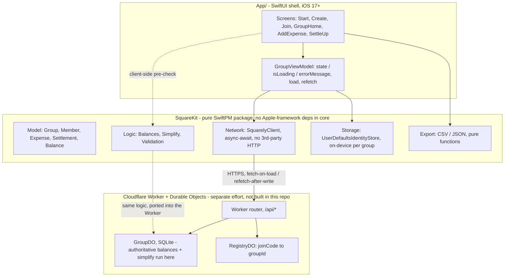

# Squarely 📐 (iOS)

An open-source, no-login expense splitter for iOS. Built for small groups (trips, shared apartments, friend circles).

> **Zero accounts · Zero ads · Zero payment processing · Exact debt simplification**

---

## What is Squarely?

Squarely is a clean, private, and frictionless way for 5–10 friends to share expenses without creating accounts, downloading bloated fintech apps, or dealing with advertising.

- **No Sign-Up / No Password**: Create a group, pick your display name, and share the link or 6-character code.
- **Exact Debt Simplification**: Collapses tangled pairwise IOUs down to the minimum possible number of settle-up transactions (at most $N-1$) using a greedy graph optimization algorithm.
- **Integer Minor Units**: Guarantees zero floating-point rounding errors across all currencies (cents, paise, yen).
- **One-Tap Settle Up**: Trust-based settlement recording.
- **Data Ownership**: Full export to CSV and JSON at any time.

---

## Screenshots

| Start | Share your group | Group Home | Add Expense | Settle Up |
|:---:|:---:|:---:|:---:|:---:|
|  |  |  |  |  |

<sub>Captured on an iOS 26 Simulator against a local mock of the API (2026-08-28 runtime verification pass).</sub>

---

## Architecture Overview

Squarely is one **pure Swift core** (`SquareKit`) wrapped in a **thin SwiftUI shell** (`App/`). All the money math lives in the core; the shell only presents it. The sync model is deliberately simple — fetch-on-load, refetch-after-write, no optimistic UI, no WebSocket (`DESIGN.md` §7).



Balances and the simplified settle-up plan are **always computed server-side** and never recomputed on the client — the same `Balances` / `Simplify` code is intended to be ported into the Worker so that logic exists in exactly one conceptual place. Until a real Worker exists, `AppConfig.apiBaseURL` points at a placeholder and the app is exercised against a local mock (see `App/README.md`).

### Repository layout

```
squarely-ios/
├── SquareKit/           # Pure SwiftPM package containing domain models, balance math,
│   │                    # the debt simplification engine, validation, and network client.
│   ├── Sources/SquareKit/
│   │   ├── Model/       # Group, Member, Expense, ExpenseSplit, Settlement, Balance
│   │   ├── Logic/       # Balances.swift, Simplify.swift, Validation.swift
│   │   ├── Storage/     # IdentityStore (local per-group identity)
│   │   ├── Network/     # Async/await HTTP sync client
│   │   └── Export/      # CSV/JSON ledger export (pure functions)
│   └── Tests/SquareKitTests/
│
└── App/                 # Native SwiftUI application shell (iOS 17+) — see App/README.md
    └── Squarely/
        ├── Screens/     # StartView, CreateGroup, JoinGroup, GroupHome, AddExpense, SettleUp
        ├── ViewModels/  # GroupViewModel — fetch-on-load/refetch, no optimistic UI
        └── Components/  # Reusable UI components, money formatting, error messages
```

### Windows & macOS First-Class Development

Because `SquareKit` is a pure SwiftPM package with zero Apple-framework dependencies in its core logic, **all domain math and unit tests can be developed and verified natively on Windows** (using the official Swift 6 toolchain) as well as macOS and Linux. The `App/` shell needs Xcode on macOS — it has been build- and run-verified on an iOS Simulator (see `App/README.md`).

---

## Getting Started

### Prerequisites
- [Swift 6+ Toolchain](https://www.swift.org/install/) (available via `winget install --id Swift.Toolchain` on Windows or Xcode on macOS).

### Running Tests
```bash
# Run tests via Makefile
make test

# Or directly via SwiftPM
swift test --package-path SquareKit
```

---

## License

This project is licensed under the [MIT License](LICENSE).
