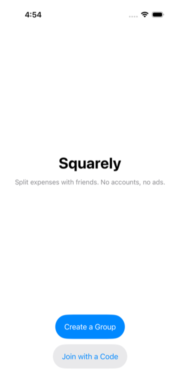
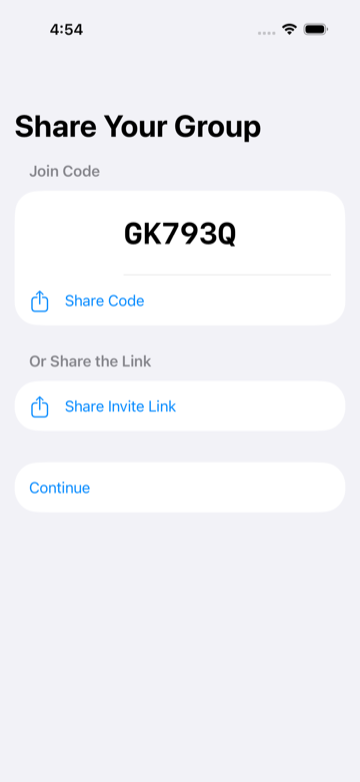
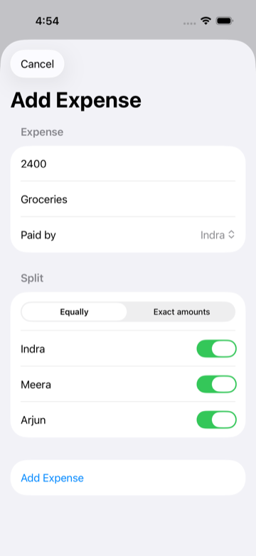
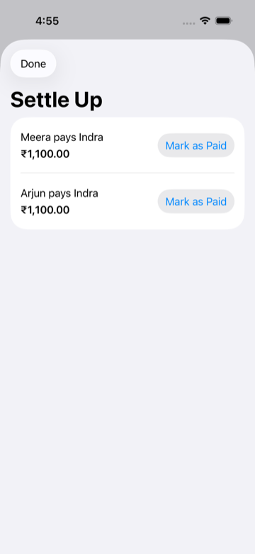
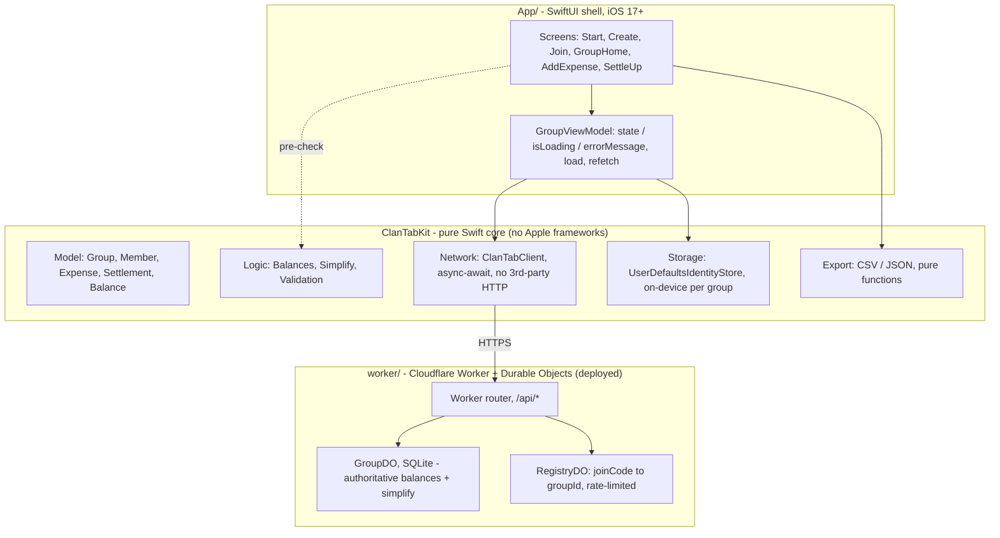

# ClanTab 📐 (iOS)

An open-source, no-login expense splitter for iOS. Built for small groups (trips, shared apartments, friend circles).

> **Zero accounts · Zero ads · Zero payment processing · Exact debt simplification**

---

## What is ClanTab?

ClanTab is a clean, private, and frictionless way for 5–10 friends to share expenses without creating accounts, downloading bloated fintech apps, or dealing with advertising.

- **No Sign-Up / No Password**: Create a group, pick your display name, and share the link or 6-character code.
- **Exact Debt Simplification**: Collapses tangled pairwise IOUs down to the minimum possible number of settle-up transactions (at most $N-1$) using a greedy graph optimization algorithm.
- **Integer Minor Units**: Guarantees zero floating-point rounding errors across all currencies (cents, paise, yen).
- **One-Tap Settle Up**: Trust-based settlement recording.
- **Data Ownership**: Full export to CSV and JSON at any time.

---

## Screenshots

| Start | Share your group | Group Home | Add Expense | Settle Up |
|:---:|:---:|:---:|:---:|:---:|
|  |  |  |  |  |

<sub>Captured on an iOS 26 Simulator during a runtime-verification run.</sub>

---

## Architecture Overview

ClanTab is a **pure Swift core** (`ClanTabKit`) behind a **thin SwiftUI shell**
(`App/`), talking to a **Cloudflare Worker + Durable Objects** backend
(`worker/`, deployed at `clantab.nakka-labs.workers.dev`). All the money math
lives in the core; the shell only presents it; the backend recomputes balances
authoritatively. The sync model is deliberately simple — fetch-on-load,
refetch-after-write, no optimistic UI, no WebSocket (`DESIGN.md` §7).



`GroupDO` recomputes balances and the simplified settle-up plan on every read — **always server-side**, never on the client. That `Balances` / `Simplify` / `Validation` logic lives in two languages, Swift (`ClanTabKit/Sources/ClanTabKit/Logic/`) and TypeScript (`worker/src/lib/`), kept byte-identical by the shared golden vectors in `test-fixtures/balances/` that **both** test suites run — a divergence turns one side's CI red. `AppConfig.apiBaseURL` points at the deployed Worker.

### Repository layout

```
clantab-ios/
├── ClanTabKit/           # Pure SwiftPM package: domain models, balance math, the
│   │                    # debt-simplification engine, validation, network client, export.
│   ├── Sources/ClanTabKit/{Model,Logic,Storage,Network,Export}/
│   └── Tests/ClanTabKitTests/
│
├── App/                 # Native SwiftUI shell (iOS 17+, XcodeGen) — see App/README.md
│   ├── ClanTab/         #   Screens · ViewModels · Components · Assets.xcassets · PrivacyInfo
│   └── ClanTabTests/    #   deep-link parsing, group-not-found handling
│
├── worker/              # Cloudflare Worker + Durable Objects backend — see worker/README.md
│   ├── src/             #   index.ts (router) · registry-do.ts · group-do.ts · lib/
│   └── test/            #   pure logic + @cloudflare/vitest-pool-workers integration
│
├── test-fixtures/       # Language-neutral golden vectors run by ClanTabKit AND worker
├── docs/                # privacy policy, App Store metadata, screenshots
├── .githooks/pre-push   # local build/test gate (macOS Actions is metered) — `make hooks`
├── DESIGN.md            # the wire / storage / security contract
├── PLAN.md · BACKEND_PLAN.md · SHIP_PLAN.md   # roadmaps: app · backend · shipping
└── HANDOFF.md           # running status log
```

### Pure core, thin shell

`ClanTabKit` has **zero Apple-framework dependencies in its core logic**, so the
domain math and its full test suite build and run on any platform the Swift
toolchain supports — the Linux CI (`.github/workflows/test.yml`) runs them on
every push, no Simulator or Xcode involved. The `App/` shell is a thin SwiftUI
layer that needs Xcode on macOS; it's build-verified and run-verified end to
end against the deployed backend (see `App/README.md`).

_(The project was originally developed on Windows against `ClanTabKit`'s pure
core, with the iOS shell built blind and verified by CI — hence some of the
history in `HANDOFF.md`. Development is on a Mac now.)_

---

## Getting Started

### Prerequisites
- **Core / backend**: [Swift 6+](https://www.swift.org/install/) and
  [Node 20+](https://nodejs.org/) (for `worker/`).
- **iOS app**: Xcode 16+ on macOS, plus `xcodegen` (`brew install xcodegen`).

### Running Tests
```bash
make check                          # everything: ClanTabKit + worker + iOS build/tests
make test                           # just the ClanTabKit suite
swift test --package-path ClanTabKit # …directly
make worker-test                    # the Cloudflare Worker suite
```

`make hooks` installs a pre-push hook that runs the relevant checks before every
push.

---

## License

This project is licensed under the [MIT License](LICENSE).
